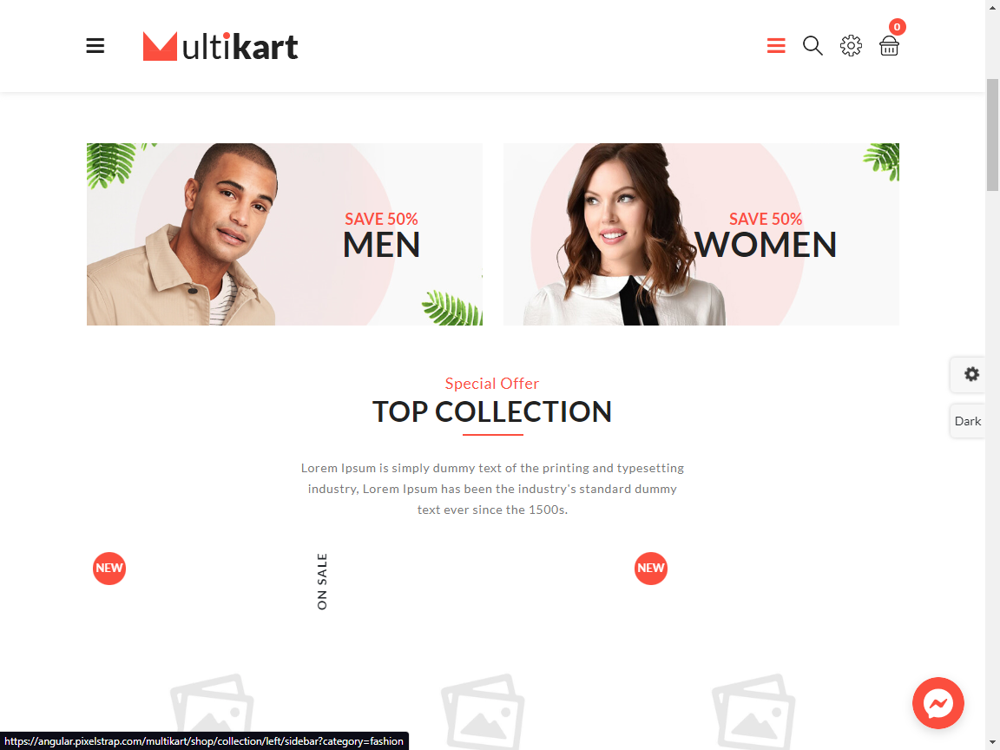
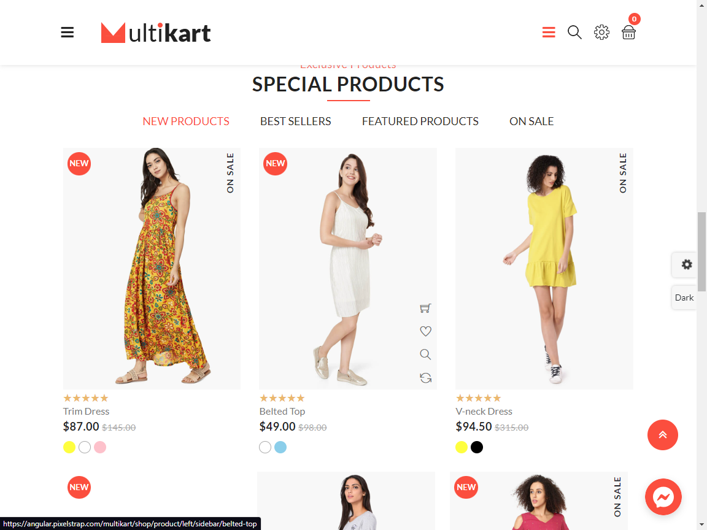

 <h2> আমাদের বাজার <h2/>

 

#### [Figma UI](https://www.figma.com/file/Douo9VLnXKBXb6B2cweSQs/Amader-Bazar?type=design&node-id=605%3A344&mode=design&t=Mne6rFKVXNd21MHM-1)

### Dashboard

This code is part of the dashboard for my e-commerce project. The project is an online store that sells a variety of products
and allows customers to browse, purchase, and track their orders. This repository contains only the code for the dashboard,
which provides an interface for store administrators to manage products, view sales data, and track orders.

The main.py file contains the entry point for the dashboard application. It initializes the Flask app and sets up the routes
for the various pages of the dashboard. The app is designed to be run locally on the administrator's machine, and requires
authentication to access the dashboard pages.

---

### UI Inspiration (Approximate)

|  |  |  |
| ------------------------------- | ------------------------------- | ------------------------------- |

### UI Inspiration

- [Front End](https://angular.pixelstrap.com/multikart/home/fashion)

### Technology

| Packages             | Description                  |
| -------------------- | ---------------------------- |
| React                | front end library            |
| Tailwind CSS         | styling                      |
| @preact/signal-react | state management             |
| React-query          | server side state management |
| Framer-motion        | Animation                    |
